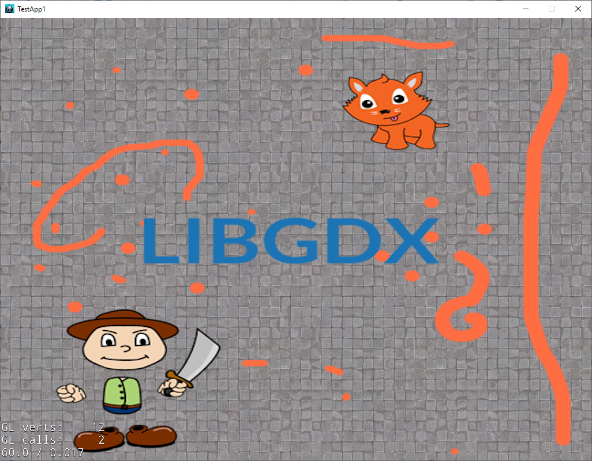
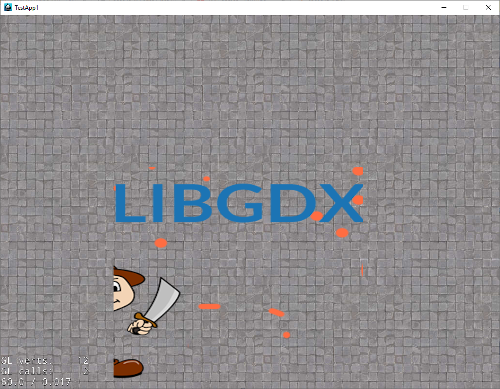
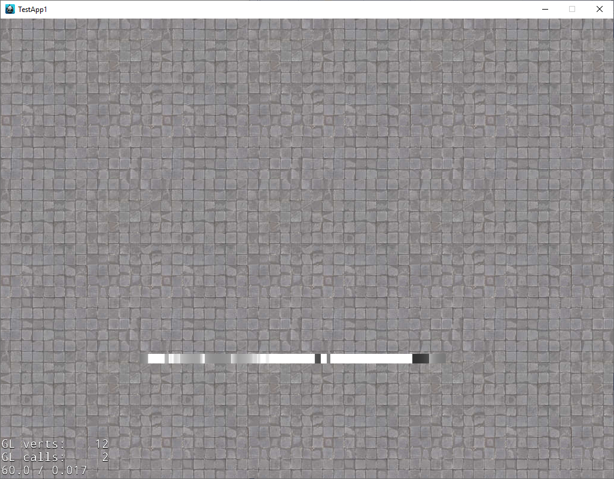
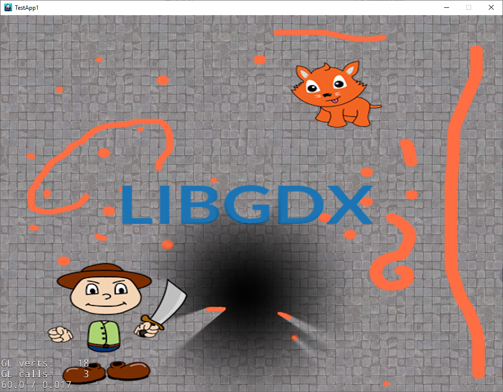
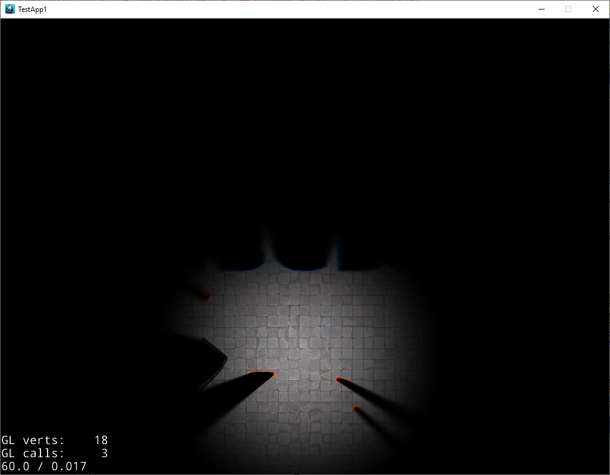

# DynamicShadows
Cocos2d-x 4.0 Dynamic shadows

<b>Source articles</b> 
https://github.com/mattdesl/lwjgl-basics/wiki/2D-Pixel-Perfect-Shadows 
https://github.com/namkazt/DynamicLight 
https://github.com/zerodarkzone/Cocos2d-x-lights 
https://github.com/JochenHeizmann/dynLight 
 
It is really work.  
<b>Code</b>
<pre>
  auto back = Sprite::create("resources/back.png");
  back->retain();
  back->setPosition(Vec2(visibleSize.width / 2 + origin.x, visibleSize.height / 2 + origin.y));
  this->addChild(back);

  auto shadowCaster = Sprite::create("resources/cat4.png");
  shadowCaster->retain();
  shadowCaster->setPosition(Vec2(visibleSize.width / 2 + origin.x, visibleSize.height / 2 + origin.y));
  this->addChild(shadowCaster);

  dynLight = DynamicLight2::create();
  dynLight->retain();
  dynLight->setShadowCaster(shadowCaster);
  dynLight->setLightSize(512);
  dynLight->setPosition(lightPosition);
  this->addChild(dynLight);//important!

  auto darkArea = dynLight->getDarkAreaMapSprite();
  this->addChild(darkArea);//must be on top
</pre>
 
<b>Steps</b> 
<ul>
  <li>
    Prepare shadow caster and background sprites 
      
  </li>
  <li>
    Create occlusion map 
      
  </li>
  <li>
    Create 1D shadow map (in code 16px) 
      
  </li>
  <li>
    Create final shadow map 
      
  </li>
  <li>
    Create dark area map (blending) 
      
  </li>
<ul>
 
